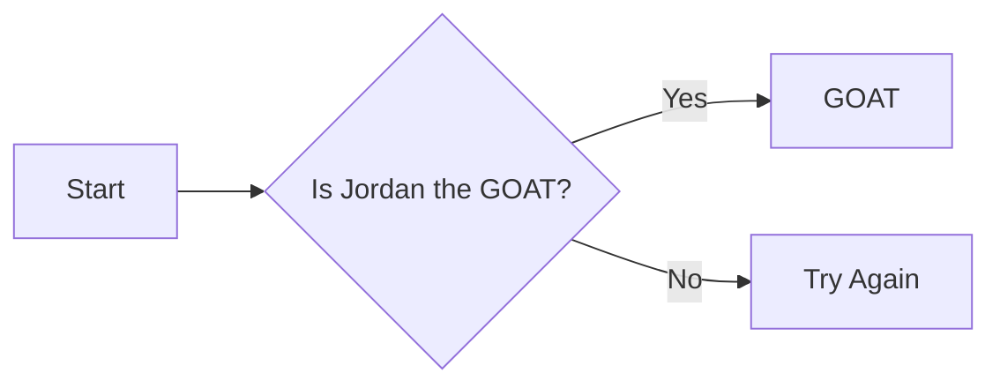

<h1 align="center">Michael Jordan is the GOAT</h1>
<main>
<p1>I'm gonna put a picture of him next to this.</p1>

<a href="readme.md">
  <button>Go to README.md</button>
</a>
</main>

<p2>Today is February 10th</p2>

# Why is He The Goat
<p3>Michael Jordan is widely considered the GOAT because no player ever matched his combination of winning, dominance, and mentality at the highest level: he went 6–0 in the NBA Finals with six Finals MVPs, led the league in scoring ten times, won five regular-season MVPs, and played elite defense, earning Defensive Player of the Year and nine All-Defensive First Team selections. At his peak, Jordan was clearly the best offensive and defensive guard in the league, consistently delivering his best performances in the biggest moments, while his relentless competitiveness elevated teammates and intimidated opponents. Beyond the numbers, he set the standard for what greatness looks like in basketball, combining unmatched peak performance with a killer instinct and cultural impact that reshaped the NBA worldwide.
Jordan’s greatness is also defined by the era he dominated, facing physical defenses and hand-checking rules that made scoring far more difficult than in the modern game. Despite these conditions, he routinely averaged over 30 points per game and still maintained efficiency, proving that his success was not a product of a softer league but of extraordinary skill, athleticism, and adaptability. Defenses were designed entirely around stopping him, yet he continued to impose his will night after night.
Another key aspect of Jordan’s legacy is his evolution as a player. Early in his career, critics claimed he could not win championships because he scored too much, but he responded by refining his game—trusting teammates, improving his playmaking, and mastering the triangle offense. This growth culminated in two three-peats, showing that Jordan was not just a scorer, but a complete leader capable of adjusting his style to achieve ultimate success.
Jordan’s competitiveness was unmatched and became a defining feature of his greatness. He approached every game, practice, and challenge with the same intensity, using slights—real or imagined—as fuel. This mindset pushed him beyond physical limitations and created a standard of excellence that transformed the Chicago Bulls into a dynasty and forced everyone around him to elevate their level of play.
Finally, Jordan’s impact extends far beyond basketball statistics and championships. He became a global icon who transcended sports, inspiring generations of athletes and redefining what it meant to be a superstar. His influence on basketball culture, athletic branding, and the global popularity of the NBA ensures that his legacy is not only measured in trophies and records, but in the lasting imprint he left on the game itself.</p3>

## How Do You Know?

### Table of Contents
[HOME](#why-is-he-the-goat)

[How Do You Know?](##how-do-you-know)
